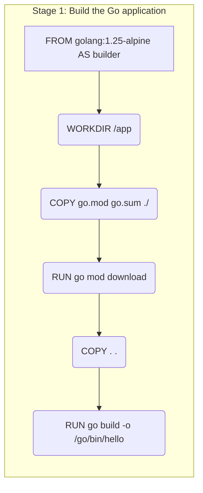

# Dockerfile Explanation

This document explains the structure and functionality of the provided Dockerfile.

## Mermaid Diagrams

### Stage 1: Build the Go application

### Stage 2: Create the final, minimal image

```mermaid
graph LR
    subgraph "Stage 2: Create the final, minimal image"
        G[FROM alpine:latest] --> H(Create non-root user)
        I(COPY --from=builder /go/bin/hello) --> K(Set file ownership)
        J(COPY --from=builder /app/index.html) --> K
        H --> K
        K --> L(USER appuser)
        L --> M(EXPOSE 8080)
        M --> N("CMD &#91;&quot;/hello&quot;&#93;")
    end
```

## Explanation

This is a multi-stage Dockerfile, which is a best practice for creating optimized and secure Docker images.

### Stage 1: `builder`

1.  **`FROM golang:1.25-alpine AS builder`**: This stage starts with the official Go image on Alpine Linux. It's labeled `builder` so we can refer to it later.
2.  **`WORKDIR /app`**: Sets the working directory inside the container to `/app`.
3.  **`COPY go.mod go.sum ./`**: Copies the Go module files into the container.
4.  **`RUN go mod download`**: Downloads the application's dependencies. This is done before copying the source code to leverage Docker's layer caching.
5.  **`COPY . .`**: Copies the rest of the application's source code into the container.
6.  **`RUN CGO_ENABLED=0 GOOS=linux go build ...`**: Compiles the Go application into a statically linked binary named `hello` and places it in `/go/bin/`.

### Stage 2: Final Image

1.  **`FROM alpine:latest`**: This stage starts from a fresh, minimal Alpine Linux image.
2.  **`RUN addgroup -S appgroup && adduser -S appuser -G appgroup`**: Creates a non-root user `appuser` and a group `appgroup` for security purposes.
3.  **`COPY --from=builder --chown=appuser:appgroup /app/index.html /index.html`**: Copies the `index.html` file from the `builder` stage and sets its ownership to the `appuser`.
4.  **`COPY --from=builder --chown=appuser:appgroup /go/bin/hello /hello`**: Copies the compiled binary from the `builder` stage and sets its ownership to the `appuser`.
5.  **`USER appuser`**: Switches the user to `appuser`. From this point on, all subsequent commands will be run as this non-root user.
6.  **`EXPOSE 8080`**: Informs Docker that the container listens on port 8080 at runtime.
7.  **`CMD ["/hello"]`**: Specifies the command to run when the container starts.
